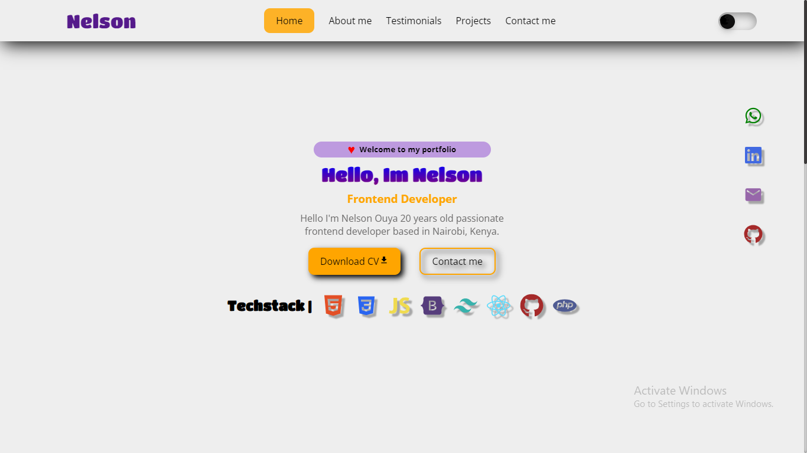

# Portfolio: [Portfolio Link](https://nelsonsportifolio.netlify.app)

## Overview
This project serves as a portfolio showcasing skills in React and Vite. It incorporates various features to create a stylish, responsive web application.

## Portfolio Features
### Overview
This portfolio demonstrates a variety of functionalities and design implementations using React and Vite.

### Implemented Features
- **React Router:** Enables seamless navigation and component rendering based on URLs.
- **Array.map Method:** Renders dynamic lists of components efficiently using `.map`.
- **Dark Mode and Light Mode Themes:** Enhances user experience with toggleable themes.
- **Desktop-First Approach:** Ensures responsiveness across different screen sizes.
- **AOS Animations:** Engaging scroll animations via AOS (Animate on Scroll) library.
- **React Icons:** Seamlessly integrates various icons using React Icons library.
- **Slider Carousel:** Presents interactive content through a slider carousel.
- **Responsive Design:** Ensures adaptability with media queries and responsive components.
- **React Mailer:** Adds email-related functionalities within the application.

## Technologies Used
- React
- Vite
- React Router
- AOS
- React Icons
- React Mailer
- Other relevant technologies

## Acknowledgments
This project was independently developed by Nelson Ouya.
